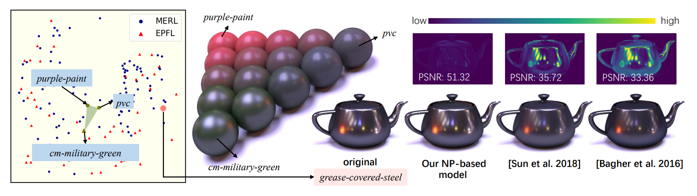

# A Compact Representation of Measured BRDFs Using Neural Processes


## Requirements

The following environment is recommended and has been tested:
- tensorflow 1.12.0
- python 3.6
- NVIDIA GPU 2080Ti

## Usage
### Pre-trained Models
- The weight of the original NP model (&sect; 3) is provided in `models/LOG4_Mean_Dim7/weight/`.
- The latent vectors of MERL and EPFL BRDFs compressed by our original NP model are provided in `latent_vectors/`.
- The trait vectors (&sect; 7.2) for BRDF editing are provided in `traits/`, and each file contains a 7-dimensional vector.
- NEWS: we have released our hypernetwork-based model (&sect; 6.1).
<!-- - We also have plans to release our hypernetwork-based model (&sect; 6.1) soon. -->

### Examples
**Compression**
- To compress a material to a latent vector, run the command: `python NPs.py --mode compress --input data/aluminium.binary --output output/aluminium_latent.npy`.
- The input file 'aluminium.binary' is an example measured BRDF, please download data from [MERL](https://cdfg.csail.mit.edu/wojciech/brdfdatabase).
- The output file contains two 7-dimensional vectors, representing the mean and logarithmic variance of the corresponding BRDF distribution.

**Decompression**
- To decompress a material from a latent vector, run the command: `python NPs.py --mode decompress --input latent_vectors/aluminium_latentVector.npy --output output/aluminium_recon.binary`.
- The output file is the measured BRDF reconstructed according to the input mean and logarithmic variance.

**Trait Editing**
- To edit a material's trait (e.g., make it brighter), run the command:`python NPs.py --mode edit --input latent_vectors/aluminium_latentVector.npy --output output/aluminium_brighter.binary --trait traits/bright.npy --trait_length 0.5`
- The parameter 'trait_length' determines the degree of material change.

**BRDF Interpolation**
- To interpolate between two materials, run the command: `python NPs.py --mode interpolation --input latent_vectors/red-plastic_latentVector.npy --input1 latent_vectors/vch_golden_yellow_rgb_latentVector.npy --int_weight 0.5 --output output/interpolation.binary`
- The paramter 'int_weight' represents the interpolation weight.

**Backbone**
- By default, BRDF decoding (used in Decompression, Editing, and Interpolation) are executed using our NP model. If the hypernetwork backbone is required, please specify the option `--backbone hypernet`.

## Citation
If you use our data or code in your research, we would appreciate a citation via 

```bibtex
@article{zheng2021compact,
  title={A Compact Representation of Measured BRDFs Using Neural Processes},
  author={Zheng, Chuankun and Zheng, Ruzhang and Wang, Rui and Zhao, Shuang and Bao, Hujun},
  journal={ACM Transactions on Graphics (TOG)},
  volume={41},
  number={2},
  pages={1--15},
  year={2021},
  publisher={ACM New York, NY}
}
```